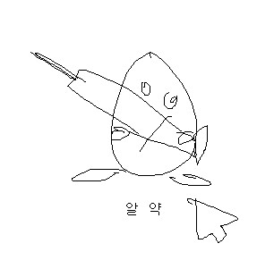

GameLiftNet
====

AWS::GameLift Server SDK for .Net environment.

```cs
using GameLiftNet;

Server::Initialize(
    PORT,
    "stdout.log", "stderr.log",
    OnStartGameSession, OnProcessTerminate, OnHealthCheck);

void OnStartGameSession(GameSession gameSession){
    Server::ActivateGameSession();
}
void OnProcessTerminate(){

}
bool OnHealthCheck(){
    return true;
}
```
<br>
<br>

```
대신귀
여운닷
넷을드
리겠습
니다.
```
